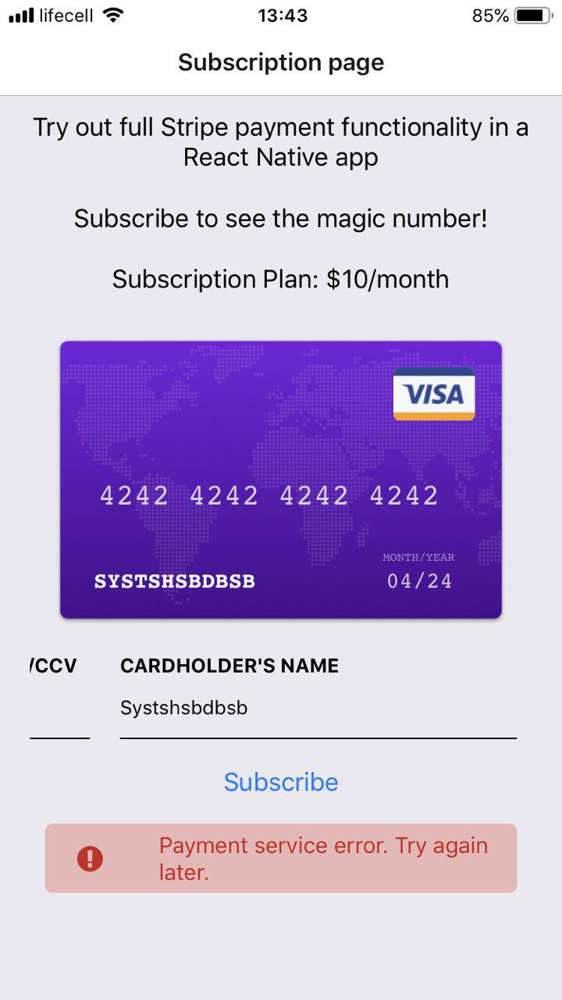

# Using stripe payment service with React Native.

When building a React Native app with Expo, you often need to integrate it with Stripe. And you often get pain in the 
neck because you can't use Stripe Elements to rapidly add an appealing payment interface to your React Native app. 
You also can't use the Stripe API with convenient methods to send your requests to Stripe.

Well, in practice you _can_ do all of that. But if you're going to use third-party libraries that must be added to the 
React Native bundle with `react-native link`, then you first need to detach Expo and handle [a few issues].

Thankfully, you don't have to run `expo eject` (to detach the Expo project) to use Stripe in a React Native project. I'm 
going to describe a very simple approach for integrating Stripe into a React Native app running with Expo (I've used a 
similar approach in [Apollo Universal Starter Kit], the open source project I'm working on).
 
Here's what we'll do:

* Implementing a custom UI for the payment form
* Validating the credit card data
* Sending manual requests to Stripe

After completing all the tasks, we get the following result:

<p align="center">
  
</p>

If you want to see the code already, have a look at [my repository]. You can also take a look at [Apollo Universal 
Starter Kit] implementation of the payment module. Otherwise, continue to the sections below.

## Sign up to Stripe service

First, you need to sign up to [Stripe] and get the API keys. I'll be using only the public keys for this project.
You can read more information about the Stripe keys and how to get them [here]. After getting the public key, go on to 
the next step.

## Generating a React Native project

To create a React Native project rapidly, I'll use the [Expo CLI]. Install the CLI globally using the following 
command:

```bash
# Install with Yarn, recommended
yarn global add expo-cli

# Install with NPM
npm install -g expo-cli
```

Then generate a React Native project:

```bash
expo init stripe-native
```

You need to answer a few typical questions, and then you'll have a generated project. From now on, I focus only on
the implementation of the components that use Stripe payments.

## Installing the libraries

Before you actually write any code, install a few libraries:

* `react-native-credit-card-input` for payment data verification
* `react-native-keyboard-spacer` for a few animations

As usual, you can use Yarn or NPM to install these libraries in your project:

```bash
cd stripe-native

# Install with Yarn, recommended
yarn add react-native-credit-card-input react-native-keyboard-spacer --dev

# Install with NPM
npm install react-native-credit-card-input react-native-keyboard-spacer --save-dev
```

Once you installed the libraries, move on to the next step &mdash; creating the components.

## Creating React Native components with Stripe

The React Native application will have just three components: One component to rule them all, the smart 
`AddSubscription` component, and two dumb components &mdash; `AddSubscriptionView` and `PaymentFormView` &mdash; that 
only render the payment form.

Let's create the `AddSubscription` component.

### A smart component to handle Stripe in a React Native app

The smart component `AddSubscription` is responsible for subscribing the user. The component carries out the following 
tasks:

* It renders the `AddSubscriptionView` (dumb) component, which we have a look at in [a later section](#creating-the-root-form-view)
* It contains a function for submitting the payment form. This function will be passed into the [payment form view](#Creating the payment form component)
* It passes the application state and the submit method to the form view

Here's the `AddSubscription` implementation, which you need to save under the `root/src/screens/` directory:

```javascript
import React from 'react';
import AddSubscriptionView from '../components/AddSubscriptionView';

const STRIPE_ERROR = 'Payment service error. Try again later.';
const SERVER_ERROR = 'Server error. Try again later.';
const STRIPE_PUBLISHABLE_KEY = 'Your Key';

/**
 * The method sends HTTP requests to the Stripe API.
 * It's necessary to manually send the payment data
 * to Stripe because using Stripe Elements in React 
 * Native apps isn't possible.
 *
 * @param creditCardData the credit card data
 * @return Promise with the Stripe data
 */
const getCreditCardToken = (creditCardData) => {
  const card = {
    'card[number]': creditCardData.values.number.replace(/ /g, ''),
    'card[exp_month]': creditCardData.values.expiry.split('/')[0],
    'card[exp_year]': creditCardData.values.expiry.split('/')[1],
    'card[cvc]': creditCardData.values.cvc
  };

  return fetch('https://api.stripe.com/v1/tokens', {
    headers: {
      // Use the correct MIME type for your server
      Accept: 'application/json',
      // Use the correct Content Type to send data to Stripe
      'Content-Type': 'application/x-www-form-urlencoded',
      // Use the Stripe publishable key as Bearer
      Authorization: `Bearer ${STRIPE_PUBLISHABLE_KEY}`
    },
    // Use a proper HTTP method
    method: 'post',
    // Format the credit card data to a string of key-value pairs
    // divided by &
    body: Object.keys(card)
      .map(key => key + '=' + card[key])
      .join('&')
  }).then(response => response.json());
};

/**
 * The method imitates a request to our server.
 *
 * @param creditCardToken
 * @return {Promise<Response>}
 */
const subscribeUser = (creditCardToken) => {
  return new Promise((resolve) => {
    console.log('Credit card token\n', creditCardToken);
    setTimeout(() => {
      resolve({ status: true });
    }, 1000)
  });
};

/**
 * The main class that submits the credit card data and
 * handles the response from Stripe.
 */
export default class AddSubscription extends React.Component {
  static navigationOptions = {
    title: 'Subscription page',
  };

  constructor(props) {
    super(props);
    this.state = {
      submitted: false,
      error: null
    }
  }

  // Handles submitting the payment request
  onSubmit = async (creditCardInput) => {
    const { navigation } = this.props;
    // Disable the Submit button after the request is sent
    this.setState({ submitted: true });
    let creditCardToken;

    try {
      // Create a credit card token
      creditCardToken = await getCreditCardToken(creditCardInput);
      if (creditCardToken.error) {
        // Reset the state if Stripe responds with an error
        // Set submitted to false to let the user subscribe again
        this.setState({ submitted: false, error: STRIPE_ERROR });
        return;
      }
    } catch (e) {
      // Reset the state if the request was sent with an error
      // Set submitted to false to let the user subscribe again
      this.setState({ submitted: false, error: STRIPE_ERROR });
      return;
    }

    // Send a request to your server with the received credit card token
    const { error } = await subscribeUser(creditCardToken);
    // Handle any errors from your server
    if (error) {
      this.setState({ submitted: false, error: SERVER_ERROR });
    } else {
      this.setState({ submitted: false, error: null });
      navigation.navigate('Home')
    }
  };
  
  // render the subscription view component and pass the props to it
  render() {
    const { submitted, error } = this.state;
    return (
        <AddSubscriptionView
          error={error}
          submitted={submitted}
          onSubmit={this.onSubmit}
        />
    );
  }
}
```

As you can see, there's nothing special in the code snippet above: I import the necessary dependencies, define a few
variables and methods, and create the main `AddSubscription` class. 

The key part in the code snippet is the function `createCreditCardToken()`:

```javascript
const createCreditCardToken = (creditCardData) => {
  const card = {
      'card[number]': creditCardData.values.number.replace(/ /g, ''),
      'card[exp_month]': creditCardData.values.expiry.split('/')[0],
      'card[exp_year]': creditCardData.values.expiry.split('/')[1],
      'card[cvc]': creditCardData.values.cvc
  };

  return fetch('https://api.stripe.com/v1/tokens', {
    headers: {
      Accept: 'application/json',
      'Content-Type': 'application/x-www-form-urlencoded',
      Authorization: `Bearer ${STRIPE_PUBLISHABLE_KEY}`
    },
    method: 'post',
    body: Object.keys(card)
      .map(key => key + '=' + card[key])
      .join('&')
  }).then(response => response.json());
};
```

This function sends a typical POST request using the Fetch API. What's important is that you should send the credit card 
data as a string: Stripe will yell at you with the demand to use the `application/x-www-form-urlencoded` if you try to 
send data in the JSON format. This is why you need to use the specific content type and encode the payment data in the 
string using `'&'` as a delimiter between key-value pairs.

Then, in the `onSubmit()` method of the class, I extract the token and credit card data from the Stripe response object
and can use it in "our server" (which doesn't exist &ndash; the `subscribeUser()` method mocks our server). 

Do not use the credit card data provided by the user for security reasons!

Let's now create the dumb `AddSubscriptionView` component.

### Creating the root form view

`AddSubscriptionView` is a simple view component with the layout for the entire payment component. I put the file 
`AddSubscriptionView.js` into the `root/src/components` folder.

Take a look at the implementation:

```javascript
import React from 'react';
import { StyleSheet, Text, View, ScrollView } from 'react-native';
import KeyboardSpacer from 'react-native-keyboard-spacer';
import PaymentFormView from './PaymentFormView';

/**
 * The class renders a view with PaymentFormView
 */
export default class AddSubscriptionView extends React.Component {
  render() {
    return (
      <View style={styles.container}>
        <ScrollView style={styles.container} ref={ref => (this.scrollViewRef = ref)}>
          <View style={styles.textWrapper}>
            <Text style={styles.infoText}>
              Try out full Stripe payment functionality in a React Native app
            </Text>
          </View>
          <View style={styles.textWrapper}>
            <Text style={styles.infoText}>
              Subscribe to see the magic number!
            </Text>
          </View>
          <View style={styles.textWrapper}>
            <Text style={styles.infoText}>
              Subscription Plan: $10/month
            </Text>
          </View>
          <View style={styles.cardFormWrapper}>
            <PaymentFormView {...this.props}/>
          </View>
        </ScrollView>
        {/* Scrolls to the payment form */}
        <KeyboardSpacer
          onToggle={() => { setTimeout(() => this.scrollViewRef.scrollToEnd({ animated: true }),0)} }
        />
      </View>
    );
  }
}

const styles = StyleSheet.create({
  container: {
    flex: 1
  },
  textWrapper: {
    margin: 10
  },
  infoText: {
    fontSize: 18,
    textAlign: 'center'
  },
  cardFormWrapper: {
    padding: 10,
    margin: 10
  }
});
```

Notice that the payment form &mdash; `PaymentFormView` &mdash; is actually a separate component `PaymentFormView` that 
I'll show next.

### Creating the payment form component

The `PaymentFormView` component provides the layout and styles for the payment form. This component will be managing the 
state of the credit card, validating the card, and displaying errors if something goes wrong after a subscription 
request was sent. 

Note that the Submit button is disabled once the user sends a request to make sure that they don't attempt to pay 
several times.
 
`PaymentFormView` receives the following props from the smart component `AddSubscription` to handle all aspects of 
processing the credit card:

* `onSubmit`, a `submit` event handler that submits the payment data
* `submitted`, a boolean value to toggle the state of the Submit button
* `error`, an error message to show when something goes wrong

Here’s the component implementation:

```javascript
import React from 'react';
import { StyleSheet, Text, View, Button } from 'react-native';
import { CreditCardInput } from 'react-native-credit-card-input';
import { FontAwesome } from '@expo/vector-icons';

/**
 * Renders the payment form and handles the credit card data
 * using the CreditCardInput component.
 */
export default class PaymentFormView extends React.Component {
  constructor(props) {
    super(props);
    this.state = { cardData: { valid: false } };
  }

  render() {
    const { onSubmit, submitted, error } = this.props;

    return (
      <View>
        <View>
          <CreditCardInput requiresName onChange={(cardData) => this.setState({ cardData })} />
        </View>
        <View style={styles.buttonWrapper}>
          <Button
            title='Subscribe'
            disabled={!this.state.cardData.valid || submitted}
            onPress={() => onSubmit(this.state.cardData)}
          />
          {/* Show errors */}
          {error && (
            <View style={styles.alertWrapper}>
              <View style={styles.alertIconWrapper}>
                <FontAwesome name="exclamation-circle" size={20} style={{ color: '#c22' }} />
              </View>
              <View style={styles.alertTextWrapper}>
                <Text style={styles.alertText}>{error}</Text>
              </View>
            </View>
          )}
        </View>
      </View>
    );
  }
}

const styles = StyleSheet.create({
  container: {
    flex: 1,
    alignItems: 'center'
  },
  buttonWrapper: {
    padding: 10,
    zIndex: 100
  },
  alertTextWrapper: {
    flex: 20,
    justifyContent: 'center',
    alignItems: 'center'
  },
  alertIconWrapper: {
    padding: 5,
    flex: 4,
    justifyContent: 'center',
    alignItems: 'center'
  },
  alertText: {
    color: '#c22',
    fontSize: 16,
    fontWeight: '400'
  },
  alertWrapper: {
    backgroundColor: '#ecb7b7',
    justifyContent: 'space-between',
    alignItems: 'center',
    flexDirection: 'row',
    flexWrap: 'wrap',
    borderRadius: 5,
    paddingVertical: 5,
    marginTop: 10
  }
});
```

That's all you need to do to create a React Native project with Expo and connect to Stripe.

Now you run the app with the command `yarn start` or `npm run start` and try a nice-looking Stripe-based payment form:

<p align="center">
  
</p>

And if the payment isn't successful, you'll see the error:

<p align="center">
  
</p> 

PS: Fot testing you can use a few [test credit cards] provided by Stripe.

[stripe]: https://stripe.com/
[here]: https://stripe.com/docs/keys
[expo cli]: https://docs.expo.io/versions/latest/introduction/installation
[a few issues]: https://docs.expo.io/versions/v24.0.0/expokit/detach#you-should-not-detach-if
[apollo universal starter kit]: https://github.com/sysgears/apollo-universal-starter-kit/tree/master/packages/client/src/modules/payments
[this repository]: https://github.com/lyzhovnik/Stripe_react_native_example
[the apollo universal starter kit implementation]: https://github.com/sysgears/apollo-universal-starter-kit/tree/master/packages/client/src/modules/payments
[test credit cards]: https://stripe.com/docs/testing
